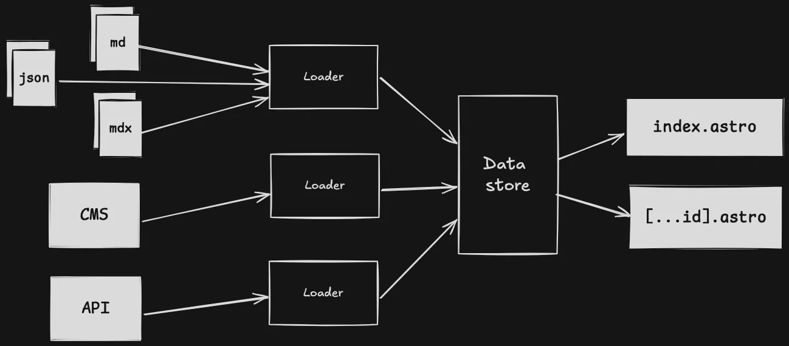

## Introducing the Cloud Resume Challenge

[The Cloud Resume challenge](https://cloudresumechallenge.dev/docs/the-challenge/aws/) has become a popular way for aspiring cloud professionals to develop their skills within the cloud.
This challenge comes in three flavours: AWS, Azure, and GCP. For my project, I have decided to tackle the AWS version.

I've attempted this challenge before using Next.js and Java, but this time, I wanted to take a different approach. After attending a talk about Cloud sustainability,
I was inspired by discussions on serverless environments such as AWS lambda. They emphasised how the overhead of the JVM and slow cold starts can make compiled languages,
like [Rust](https://www.rust-lang.org/) a greener and more efficient choice for cloud computing.

To make this challenge more exciting, I've decided to make a few modifications instead of using plain HTML and CSS, I opted to use [Astro](https://astro.build/), a modern framework optimised for fast, content-driven websites.
Additionally, with the increasing focus on security within supply chains of software within the industry,
I have also decided to integrate key security measures to ensure that my project aligns with the security best practices from the [SLSA](https://slsa.dev/).

## Building a website for the stars with Astro

The first step in my project was building the website using Astro. I began by adding Markdown support for writing blog posts,
which streamlined my workflow for creating content. Now, all I need to do is write a Markdown file,
and Astro’s content layer API automatically generates a fully built page with the content!

<figure className="dark:text-gray-300">[Content Layer Diagram](https://astro.build/blog/astro-5/) by Astro </figure>

Before moving on to the next step of the challenge, I ensured my website is fully responsive on mobile platforms using Tailwind CSS.
In addition, I added Biome, which is a tool that helps maintain quality code by formatting and linting.

## Hosting in the cloud

With the website built, the next step was hosting it on AWS. Thankfully, Astro supports static site generation, meaning I can build my website
and then upload the contents of the dist/ folder to an S3 bucket to serve it.

To improve performance and availability, I set up CloudFront, a [CDN](https://aws.amazon.com/what-is/cdn/) that caches my website globally. However, I was left
with a terrible auto-generated URL. However, this can be solved with [Route53](https://aws.amazon.com/route53/). Route53 is the AWS DNS service which allows me to manage my Domain from within AWS.

I purchased a domain from [PorkBun](https://porkbun.com/) for £10.50 and simply updated the name servers to point to Route53. To tie it all together,
I configured an A record pointing to my CloudFront distribution, and set up an SSL certificate using AWS Certificate Manager. Now, my website is fully hosted on AWS,
complete with a custom domain and HTTPS!


## Building a serverless backend with Rust

Now this is where things start to get more interesting. For this part of the challenge, I needed to build an API using AWS Lambda that would track visitors to my website,
with the data stored in a database.  I used DynamoDB a fast, serverless, and cost-effective database, which pairs perfectly with the serverless nature of Lambda.


When researching how to implement Lambda functions in Rust, I discovered [Cargo Lambda](https://www.cargo-lambda.info/) in the AWS documentation.
This tool proved invaluable, significantly simplifying the development process for Rust-based AWS Lambdas. I was able to iterate quickly using
live reloading of Lambda functions during local development, in conjunction with Postman to see the responses without having to manually rebuild.
In addition to the ability to build cross-platform enabled me to build on windows x86, and use ARM when deploying with just a simple flag!

### Lambda Initialisation Optimisation
I carefully moved function calls outside the main handler and implemented connection reuse through a shared configuration. These led to some impressive improvements:

- Ensured resources are properly cached between invocations
- Reduced average response times from **~140 ms** in Java to just **6–8 ms** in Rust
- Made the user experience significantly faster

### Architecture and Resource Optimisation
The switch to Rust enabled significant infrastructure improvements:

- Cold start reduction: 5596 ms → 125 ms **(97.8% faster)**
- Average memory usage 152MB → 24MB **(84.2% reduction)**
- Memory allocation: 512MB → 128MB **(75% reduction)**
- Architecture migration: x86 → ARM64
- Cost per ms: $0.0000000083 → $0.0000000017 **(79.5% savings)**

While these numbers may seem small, they add up quickly at scale and show a massive gain in efficiency from using Rust.

### Troubleshooting CORS Challenges
While building my Lambda function, I encountered a flag in the HTTP headers, When testing responses in Postman,
I noticed the "Varies" header, but I was unsure of where it had come from. When I was deploying an AWS gateway and trying to test,
I found that my CORS were failing, so I decided to do some troubleshooting. That's where I learned about cURL, a utility that allows
developers to test HTTP requests. I decided to check the pre-flight options using my local setup to ensure that I minimised any possible issues from AWS.
In my terminal I ran the following command:

```bash title="cURL CORS test"
curl -i -X OPTIONS http://localhost:9000/  -H "Origin: http://localhost:4321"  -H "Access-Control-Request-Method: GET"  -H "Access-Control-Request-Headers: Content-Type"
HTTP/1.1 200 OK
access-control-allow-origin: http://localhost:4321
access-control-allow-credentials: true
vary: origin
vary: access-control-request-method
vary: access-control-request-headers
access-control-allow-methods: GET
access-control-allow-headers: Content-Type
content-length: 0
```

The API when tested locally from cURL did end up responding as expected,
so I knew that the CORS middleware cors layer was working as intended.
It was just varied the responses depending on what headers were sent to the API.
Consulting the Mozilla HTTP docs for [CORS](https://developer.mozilla.org/en-US/docs/Web/HTTP/CORS#access-control-allow-origin),
confirmed the CORS middleware works as intended.

Furthermore, another issue I had was when I was writing my lambda, I decided to limit it to only POST requests, this caused an issue when I was trying to use an APIGateway,
this is because all pre-flight OPTIONS requests were being blocked, to fix this, I simply changed my lambda to also allow for preflight OPTIONS requests.

### Integration Testing with Cargo

Ensuring that software works as intended is crucial, especially when deploying through CI/CD. To verify the functionality of my API, I wrote two integration tests:

- One for retrieving visitor data
- One for updating visitor data

These tests interact with a test DynamoDB table, allowing me to validate the database logic without affecting production data.
Each test sets up the required resources and automatically cleans them up afterward to maintain isolation and avoid conflicts.

### Using the API with Astro and React

To display visitor data on my portfolio website, I integrated my API with Astro and React. Astro handles the static structure of the page,
while React provides interactivity for fetching and updating visitor counts dynamically.

Within React, I used TypeScript to ensure the API returns a number, improving type safety. Additionally,
I used state management to provide feedback if the API takes time to respond and to handle errors more gracefully.
Astro’s partial hydration feature allows the React component to only load when needed, reducing the overall JavaScript bundle size and improving performance.

## Terraforming my challenge

With all the resources to be managed, typically developers use some form of Infrastructure as Code (IaC), previously I used
[AWS CloudFormation](https://docs.aws.amazon.com/AWSCloudFormation/latest/UserGuide/Welcome.html) however, I felt it was limiting and decided to try Terraform,
to help me learn about Terraform best practices, I used [Complete Terraform Course - From BEGINNER to PRO! (Learn Infrastructure as Code)](https://youtu.be/7xngnjfIlK4?si=lAc-uzB3R6WFnyfd) by DevOps Directive.

I also decided to try using Terraform import, this helps me reuse in AWS resources from my previous challenge and manage them within Terraform. However, before you can import all of your resources,
you must first build a Terraform configuration. This is where I used the [Terraform AWS Provider](https://registry.terraform.io/providers/hashicorp/aws/latest/docs) to build my Terraform configuration,
adding each piece to a module for the backend and frontend for modularity. Then the import process simply involved identifying existing AWS resources, and using the command `terraform import aws_s3_bucket.website bucket-name`
to bring them under Terraform management. While transitioning to Terraform, I used a test domain to verify that all the imported infrastructure and any newly created infrastructure worked as expected.

## Diving into DevOps with GitHub actions

Now that I had everything set up, I decided to try using GitHub actions to automate the deployment of my website and Lambda function.
This turned out to be more challenging than I expected, due to using the cargo lambda tool, initially I was .
I also had issues with OpenID Connect (OIDC) as I had not configured the GitHub repository to allow access to the AWS account, this required me to .
Once I had everything working, it was as easy as pushing a commit to the main branch, and the website and the backend are automatically deployed.


## What's next?

 - I would like to add more logging features using cloudwatch logging and change my API to allow for a visitor count on each blog post.
 - I would like to build with Spring boot and explore React.
 - I would like to study and achieve my AWS Certified Solutions Architect certification.