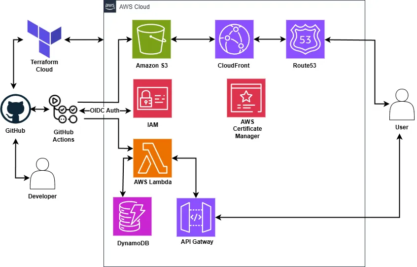

import contentLayerArchitecture from './content-layer-architecture.webp';
import { Image } from 'astro:assets';

## Introducing the Cloud Resume Challenge

[The Cloud Resume challenge](https://cloudresumechallenge.dev/docs/the-challenge/aws/) has become a popular way for aspiring cloud professionals to develop their skills within the cloud.
This challenge comes in three flavours: AWS, Azure, and GCP. For my project, I have decided to tackle the AWS version.

I've attempted this challenge before using Next.js and Java, but this time, I wanted to take a different approach. After attending a talk about Cloud sustainability,
I was inspired by discussions on serverless environments such as AWS lambda. They emphasised how the overhead of the JVM and slow cold starts can make compiled languages,
like [Rust](https://www.rust-lang.org/) a greener and more efficient choice for cloud computing.

To make this challenge more exciting, I've decided to make a few modifications instead of using plain HTML and CSS, I chose [Astro](https://astro.build/), a modern framework optimised for fast, content-driven websites.
Additionally, with the increasing focus on software supply chain security, I have integrated a few security practices into the project.

## Building a website for the stars with Astro

The first step in my project was building the website using Astro. I added Markdown support for writing blog posts,
which streamlined content creation. Now, all I need to do is write a Markdown file,
and Astro’s Content Collections API automatically generates a complete built page with the content!

<figure className="dark:text-gray-300">
    <Image
        src={contentLayerArchitecture}
        alt="Content Collections API Diagram"
        loading="eager"
        fetchpriority="high"
    />
    <figcaption>
        <a href="https://astro.build/blog/astro-5/">Content Layer Diagram by Astro</a>
    </figcaption>
</figure>

Before moving on to the next step of the challenge, I ensured my website is fully responsive on mobile platforms using Tailwind CSS.
In addition, I integrated Biome, a tool for formatting and linting code, to help maintain code quality.

## Hosting in the cloud

With the website built, the next step was hosting it on AWS. Astro supports static site generation, so I can build my website
and then upload the contents of the dist/ folder to an S3 bucket.

To improve performance and availability, I set up CloudFront, a [CDN](https://aws.amazon.com/what-is/cdn/) that caches content globally.y. However, the auto-generated CloudFront URL wasn’t ideal. To fix that, I used [Route53](https://aws.amazon.com/route53/). AWS’s DNS service, to point a custom domain to my CloudFront distribution.

I purchased a domain from [PorkBun](https://porkbun.com/) for £10.50 and updated the name servers to point to Route53.
Then I configured an A record to point to CloudFront and set up HTTPS with AWS Certificate Manager. Finally, I had a fully hosted static site on AWS, complete with a custom domain and SSL.

## Building a serverless backend with Rust

This is where things start to get more interesting. I needed to build an API using AWS Lambda that would track visitors,
with the data stored in a database. I used DynamoDB a fast, serverless, and cost-effective database.


While researching how to write Rust Lambda functions, I discovered [Cargo Lambda](https://www.cargo-lambda.info/) in the AWS documentation.
It significantly simplified the development process by providing live reloading during local development and built-in cross-compilation.
I could also build locally on Windows x86 and deploy to ARM64 with a simple flag.

### Lambda Initialisation Optimisation
I carefully moved function calls outside the main handler and implemented connection reuse through a shared configuration. These led to some impressive improvements:

- Ensured resources are properly cached between invocations
- Reduced average response times from **~140 ms** in Java to just **6–8 ms** in Rust
- Made the user experience significantly faster

### Architecture and Resource Optimisation
The switch to Rust enabled significant infrastructure improvements:

- Cold start reduction: 5596 ms → 125 ms **(97.8% faster)** - Cold starts refer to the initial delay when a function is invoked for the first time or after being idle. Reducing cold start times improves responsiveness and user experience.
- Average memory usage 152MB → 24MB **(84.2% reduction)**
- Memory allocation: 512MB → 128MB **(75% reduction)**
- Architecture migration: x86 → ARM64
- Cost per ms: $0.0000000083 → $0.0000000017 **(79.5% savings)**

While these numbers may seem small, they add up quickly at scale and show a massive gain in efficiency and user experience from using Rust.

### Troubleshooting CORS Challenges
While testing the API with Postman, I noticed issues with CORS and a mysterious Vary header. After searching around about how to check headers, I used cURL to send an OPTIONS request:


```bash title="cURL CORS test"
curl -i -X OPTIONS http://localhost:9000/  -H "Origin: http://localhost:4321"  -H "Access-Control-Request-Method: GET"  -H "Access-Control-Request-Headers: Content-Type"
HTTP/1.1 200 OK
access-control-allow-origin: http://localhost:4321
access-control-allow-credentials: true
vary: origin
vary: access-control-request-method
vary: access-control-request-headers
access-control-allow-methods: GET
access-control-allow-headers: Content-Type
content-length: 0
```

The local Lambda responded as expected, confirming the CORS middleware was working.
According to the Mozilla HTTP docs for [CORS](https://developer.mozilla.org/en-US/docs/Web/HTTP/CORS#access-control-allow-origin),
the Vary header changes based on the request, and this behaviour was normal.

I also hit another issue when deploying to API Gateway, I initially restricted the Lambda to only POST requests. This caused AWS API Gateway to block the preflight OPTIONS requests. I fixed this by allowing OPTIONS in the Lambda.

### Integration Testing with Cargo

Ensuring that software works as intended is crucial, especially when deploying through CI/CD. To verify the functionality of my API, I wrote two integration tests:

- One for **retrieving** visitor data
- One for **updating** visitor data

These tests interact with a test DynamoDB table, allowing me to validate the database logic without affecting production data.
Each test sets up the required resources and automatically cleans them up afterward to maintain isolation and avoid conflicts.

### Using the API with Astro and React

I integrated my API with Astro and React. Astro handles the static content,
and React fetches and displays the visitor counts dynamically.

I used TypeScript to ensure the API returns a number, improving type safety, and
added state management to provide feedback if the API takes time to respond and to handle errors more gracefully.
Astro’s partial hydration only loads the React component when needed, keeping the JavaScript bundle size small and improving performance.


### E2E testing with Playwright

To ensure the visitor counter worked correctly, I used Playwright to run end-to-end tests. The test checks that the visitor count increases by one when accessing both the API endpoint and the live website. This checks that both the UI behaviour and backend with the database all work as intended.

I integrated the tests into my GitHub Actions pipeline for continuous integration when pushing to the main branch.

While running the playwright test, I ran into issues with Playwright, as tests run in parallel, different browsers were incrementing the counter at the same time, which lead to flaky test results.
To fix this, I configured the Playwright test runner to use a single worker in my playwright.config.ts:

```ts title="playwright.config.ts"
import { defineConfig } from '@playwright/test';

export default defineConfig({
  workers: 1,
});
````
With this change my tests now run sequentially preventing race conditions and making the tests consistent.

## Terraforming my challenge

With all the resources to be managed, it's a good idea to use Infrastructure as Code (IaC), previously I used
[AWS CloudFormation](https://docs.aws.amazon.com/AWSCloudFormation/latest/UserGuide/Welcome.html) but I found it limiting and decided to try Terraform.
To help me learn Terraform best practices, I used [Complete Terraform Course - From BEGINNER to PRO! (Learn Infrastructure as Code)](https://youtu.be/7xngnjfIlK4?si=lAc-uzB3R6WFnyfd) by DevOps Directive.

I reused resources from my previous challenge, using terraform import, which brings existing AWS infrastructure under Terraform management. Before importing, I built a Terraform configuration using the [Terraform AWS Provider](https://registry.terraform.io/providers/hashicorp/aws/latest/docs)
and split it into a module for the backend and frontend for better structure.

Then to import I identified existing AWS resources and imported them using the terraform import command, for example:
```terraform
terraform import aws_s3_bucket.website bucket-name
```
Brings the S3 bucket under Terraform management. While transitioning to Terraform, I used a test domain to verify that all the infrastructure worked as expected before moving to production.

## Diving into DevOps with GitHub actions



With everything set up, I got to the automation the deployment of my website and Lambda function using GitHub Actions.
It was trickier than expected due to using cargo lambda. After digging into the docs, I ended up installing it via pip inside the CI pipeline.

I also added a job that runs cargo audit to check for security issues and switched to GitHub’s new ARM64 runners for deploying the Lambda. This skips the cross-compilation for x86, which reduces build times.

To ensure that I didn't use any long-term AWS credentials which could be abused, I implemented OpenID Connect in my GitHub actions workflows. This allows GitHub to securely request temporary AWS credentials at runtime.
While running the pipelines, I hit an unexpected problem; OpenID Connect (OIDC) wasn’t properly set up. So when I ran them, my GitHub repositories didn’t have access to the AWS account. I had to update my Terraform code to specify the correct repositories and AWS audience.

Once it was all working, deployment became as easy as pushing to the main branch of the repository, and it will be deployed automatically.

## What's next?

In the future I would like to continue working on this project, and I will also be expanding my skills in other ways by:

 - Implementing **CloudWatch Logging** to gain deeper insights into lambda behaviour and improve debugging.
 - Extending the API to track **visitor counts on individual blog posts**, enabling a deeper understanding on content engagement.
 - Exploring **Spring Boot** and **React** by building my mental health planner, broadening my development skills.
 - Working towards the **AWS Certified Solutions Architect** certification to further enhance my skills in AWS.