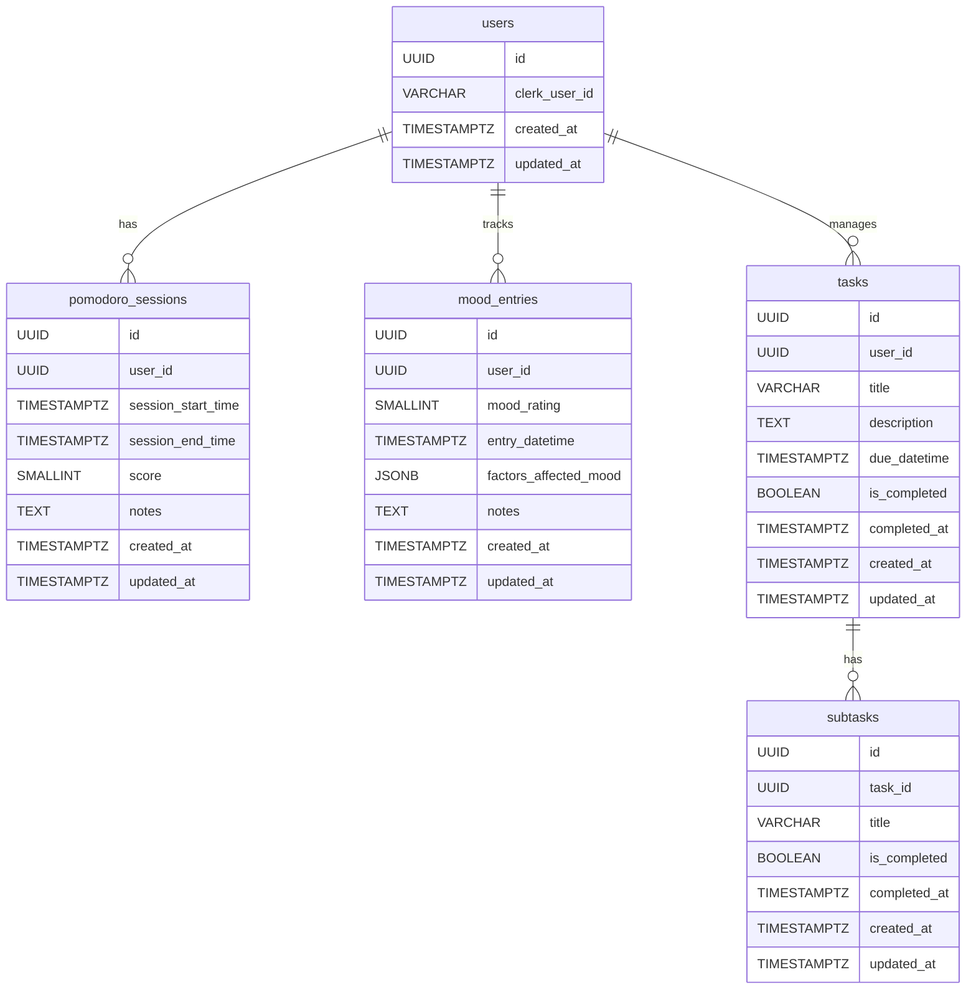
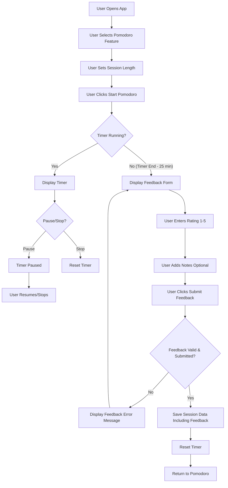
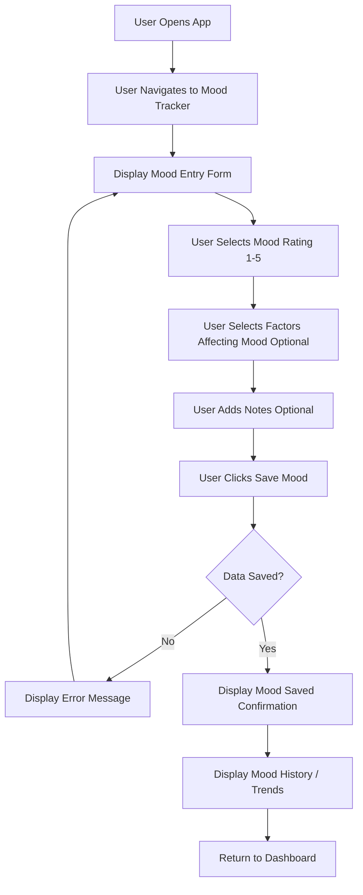
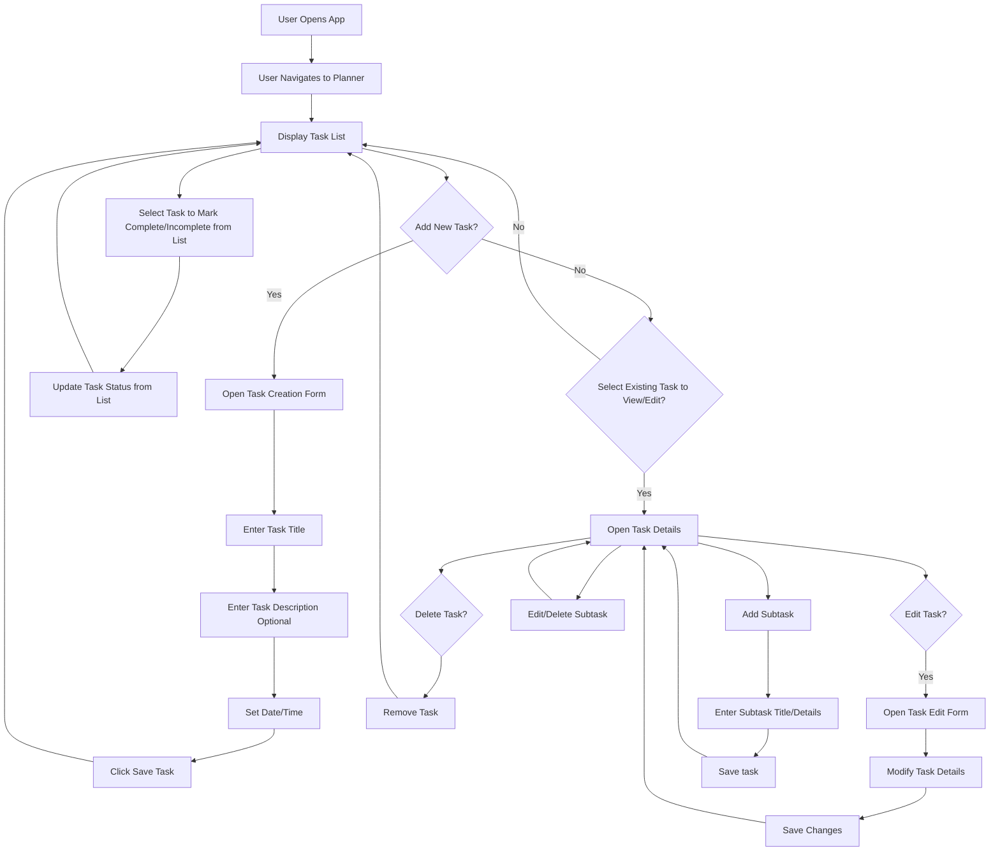

## Motivation

When I was exploring options for digital planners and to-do apps, I found an overwhelming number of options, but very few fit
what I felt my needs are. So that's where this project comes in I want to build an app that will help me track my daily moods
and what has affected my mood, allowing me to be able to.

## Tech stack

### Frontend

For the frontend I've chosen Next.js, based on React. React has a vast ecosystem of components and an excellent community. Next.js's app router pattern offers
a fantastic and scalable structure for web applications, making data fetching and navigation intuitive. Another advantage is Next.js offers
support for **Server-Side Rendering (SSR)** and **Static Site Generation (SSG)** out-of-the-box developers can render pages on the server to help reduce loading times drastically,
and improving overall user experience.

To speed up UI development, I'll be leveraging the Shadcn/ui library. Based on Radix primitives and styled with Tailwind CSS,
Shadcn/ui provides customisable components, allowing for perfect integration with my design vision while offering great accessibility features.

For state management I'm opting for [Zustand](https://zustand.docs.pmnd.rs/getting-started/introduction).
I'm interested in its performance and minimalist API. With its intuitive store creation, small bundle size, hook-based access,
and even reduced boilerplate, I hope it will prove to be a solid choice I come back to in the future.

Additionally, for data fetching I plan to use [TanStack Query](https://tanstack.com/query/latest) formerly known as React Query.
This library has a stellar reputation in the React community for its ease of use, and powerful toolset including caching, background updates, SSR support, and more!

### Backend

Spring Boot will power the backend of this application. I have always desired a dive deep into the Spring ecosystem and to get back into Java development.
Beyond personal learning, I'm drawn to Spring Boot's incredibly powerful feature set, which will be invaluable for easily expanding the application's features in the future.
Its robust nature and deep integrations with Spring cloud for cloud platforms like AWS also make it an ideal choice for a reliable and scalable backend service as the project grows.

For the database, I will be using PostgreSQL. Its reliability, performance, and rich feature set make it a strong choice for storing and managing the application's data.

### Authentication

For authentication, I'm building on top of the [Clerk](https://clerk.com/) user management platform. Handling user authentication is notoriously complex and developers can fall into many security pitfalls,
so it's a domain where reinventing the wheel is rarely a good idea. Clerk offers an amazing, first-class library of features specifically for Next.js and React apps,
including seamless middleware integration, and pre-built UI components. Clerk has a generous free tier, making it a compelling choice for personal projects.
Most importantly for my use-case, Clerk allows for the use of JSON Web Tokens (JWTs), which provides the flexibility needed to integrate securely with my custom Spring Boot backend.

## Diagrams

To give myself a clearer picture of how my application will fit together, I've used diagrams to visualise the overall application structure,
key workflows, and the database schema using Entity Relationship Diagrams (ERDs). These visuals translate complex descriptions into easily understandable diagrams.

### Database Schema (ERD)

This Entity Relationship Diagram (ERD) outlines the tables in my PostgreSQL database and their relationships, providing a clear overview of the application's data model.

### Pomodoro feature flow

This flowchart shows the user's journey through the pomodoro feature, from starting the pomodoro session, setting the timer,
to pausing and stopping the timer, and completing the feedback form for the session to be saved for later reference.

### Mood tracker feature flow

This flowchart shows the user flow for the mood tracker; from selecting their mood from very bad to very good,
they'll be able to add notes on what affected them that day, they will also be able to tag factors that affected their mood.
These features will make it easier for the user to filter and interpret their mood data to find patterns and improve their quality of life.

### Planner and Task management feature flow

This flowchart is the most complex with being the main feature of the application. The user will start
on their current calendar week, where they can view all of their tasks for that week, clicking on the day of the week they can add tasks;
each task has a title, description, data/time, and subtasks. The user will be able to tick off tasks and subtasks from the main task list,
they will also be able to edit any task or delete it from the calendar directly.

## The journey has only begun!

I hope this overview of my application has been inciteful, and you join me on this journey. I will be updating this blog
 with the challenges I face and how I overcome them, and tips learned along the way, so please check back soon!

jobs@onebigcircle.co.uk